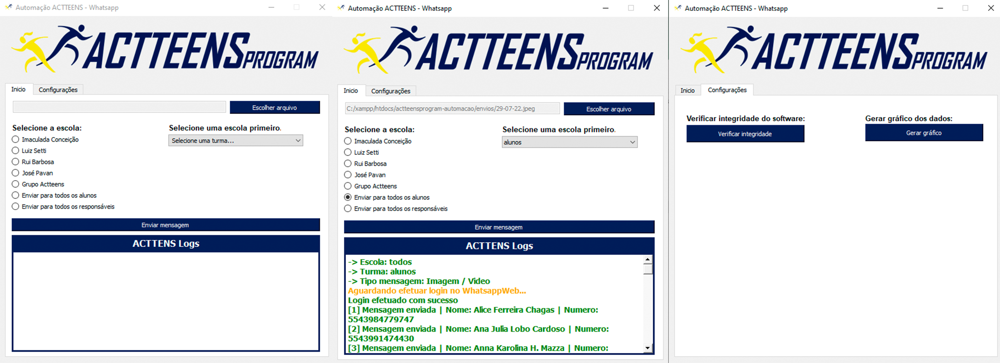

# 💻 Automação WhatsApp - ACTTEENS Program

<h1 align="center">
  
</h1>

---

## 📚 Seções

O software contém as seguintes seções:

- **Início:** Nessa tela temos todas as opções para efetuar os envios das mensagens/arquivo;
- **Configurações:** Opção para verificar integridade e gerar gráfico;

---

## 🛠️ Desenvolvido com

Para o desenvolvimento deste software eu usei as seguintes tecnologias:

- Qt Designer;
- Python 3.9.10;
- PyQt5;
- Selenium;
- Pandas;
- Numpy;

Todas as versões das bibliotecas estão no requirements.txt

---

## ⚙️ Descrição

Este projeto foi desenvolvido quando bolsista na universidade sem fronteiras da UENP(Universidade Estadual do Norte do Paraná). Tem como objetivo automatizar o envio de mensagens no whatsapp dos alunos e responsáveis, seguindo uma lista de números que é fornecida no excel.

---

## ✒️ Autor

<table>
  <tr>
    <td align="center">
      <a href="https://github.com/Gabriellimmaa">
         
        
          <b>Gabriel Lima</b>
        
      </a>
    </td>
  </tr>
</table>

---

Obrigado por me ceder seu tempo lendo sobre o meu trabalho.

Qualquer dúvida, crítica ou sugestão entre em, <a href="mailto:gabriellimamoraes@gmail.com/">contato</a> pelo meu e-mail
